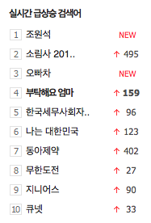

# 네이버 '실시간 금상승 검색어' UI 컴포넌트 

주소 : http://naver.com 
UI컴포넌트 이름(id) : "ranklist" 
ranklist -> PC로 접속했을 때 기본 상태 
 
rankpop -> 마우스가 over 되었을 때 1부터 10까지 모두 표시하는 상태.  
 

## 마크업 특징 : 

- 1부터 10까지 등수가 매겨져 있다. 
- 급상승 검색어 표시 
- 상승/하락 인지를 표시 (화살표)
- 상승/하락 일 경우 점수를 숫자로 표시 
- 새로진입의 경우 NEW로 표시

## 오브젝트로 정의 : 

~~~
/* 검색어 단일 */
{
	rank: {
		value: 1, 
		keyword: '검색어', 
		state: 'NEW/UP/DOWN',  
		/* 새로진입/상승/하락 */
		rank: 75
	}
}

/* 검색어 10개 */
{
	"rankList": [
		/* {rank} */ 
	]
}
~~~

## UI 컴포넌트로서의 특징 : 

- 1부터 10까지 순차적으로 '급상승 검색어'를 강조한다. 
- ranklist일 경우 하나만 표시
- 하나만 표시할 경우 다음 검색어로의 이동은 일정한 시간 간격을 두고 자동으로 변경. 
- rankpop일 경우 '굵게' 표시되도록 한다. 
- ranklist일 때 마우스 over시 rankpop으로 변경이 되고 
- rankpop으로 변경되면 더이상 자동 롤링이 작동되지 않는다.
- rankpop에서 마우스가 out될때는 ranklist로 변경되며, 
- ranklist로 변경되면 자동 롤링이 다시 시작. 

## 구현과 더불어 신경써야 하는 부분. 

1. 크로스브라우징 대응 (쿼트, IE6+ 모든 버전.)
2. 반응형 대응
3. JSON부터 시작하는 마크업 디자인 
4. '실시간 금상승 검색어'를 기획하는데 있어서 필요한 모든 내용들을 최대한 뽑아낸다. (비록 이쁘게/멋지게 정리되지 않더라도..)
5. 기획 내용에 '이벤트'에 대한 내용을 명확히 기재할 수 있도록 최대한 연습. (앞으로의 기획은 마크업 설계와 이벤트/제스쳐를 얼마나 잘 디자인하고 설계하는지가 중요할듯 하다.)

